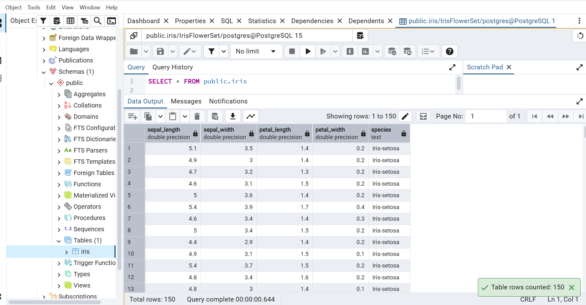
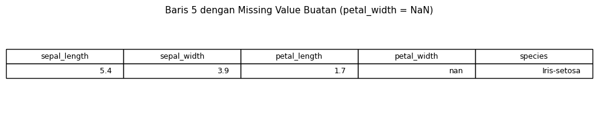
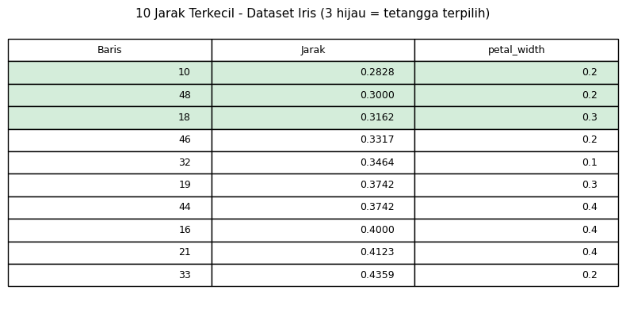
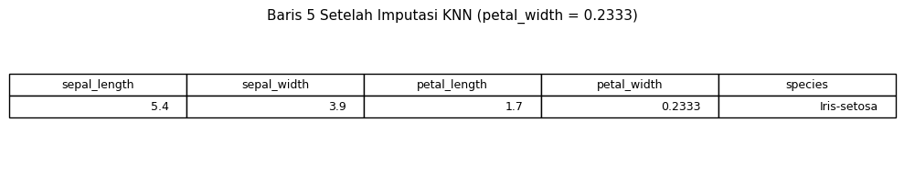
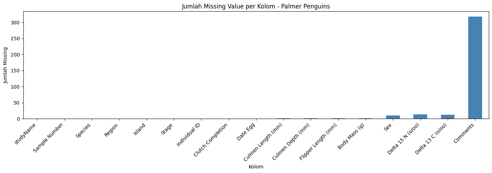
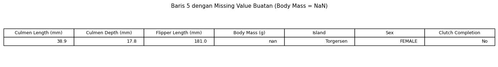
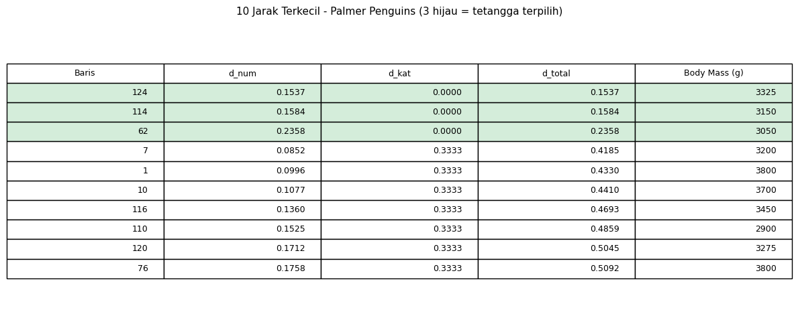
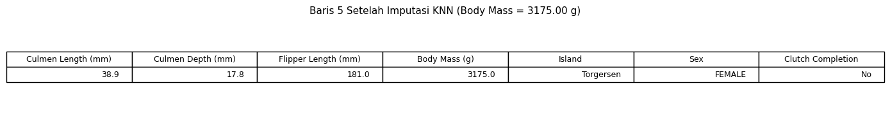

# DATA PREPARATION — PERTEMUAN 3
## Studi Kasus: Iris + Data Campuran (Mixed-Type)

```{admonition} Identitas Mahasiswa
:class: note

| | |
|---|---|
| **Nama** | Aisya |
| **NIM** | 240411100025 |
| **Mata Kuliah** | Penambangan Data |
| **Pertemuan** | 3 — Data Preparation |
```

Dokumen ini melanjutkan materi Data Preparation dalam kerangka **CRISP-DM** yang mencakup:
identifikasi missing value, statistik deskriptif, encoding, scaling, **pengukuran jarak**, dan penanganan **data campuran (mixed-type)**.

---

## ✅ Tugas Pertemuan 3

```{admonition} Tugas yang Harus Diselesaikan
:class: important

Berikut tiga tugas utama pada Pertemuan 3 beserta status penyelesaiannya:

| No | Tugas | Status | Keterangan |
|:--:|-------|:------:|------------|
| 1 | **Mengukur Jarak** — ditempatkan di bawah bagian *Data Understanding* | ✅ Selesai | Euclidean, Manhattan, Spearman, Hamming pada data Iris (CSV & SQL) — lihat **Section 3.13–3.14** |
| 2 | **Buat/Cari Data Campuran** — mengandung tipe ordinal, numerik, kategorikal, dan biner | ✅ Selesai | Dataset **Palmer Penguins** (`penguins_lter.csv` + PostgreSQL `Penguins`) — lihat **Section 3.15** |
| 3 | **Lakukan Pengukuran Jarak pada Data Campuran** tersebut | ✅ Selesai | 4 metrik jarak diterapkan di Orange pada data Palmer Penguins — lihat **Section 3.15.5** |
```

> **File Orange Workflow:** {download}`Penguins.ows <DataCampuranPertemuan3/Penguins/Penguins.ows>`
>
> **File CSV Data:** {download}`penguins_lter.csv <DataCampuranPertemuan3/Penguins/penguins_lter.csv>`
>
> **File SQL Database:** {download}`Penguins.sql <DataCampuranPertemuan3/Penguins/Penguins.sql>`
>
> **Notebook KNN Imputation (Google Colab):** [Pertemuan3_KNN_Imputation.ipynb](Pertemuan3_KNN_Imputation.ipynb)

---

## 3.1 Konsep CRISP-DM

**CRISP-DM** (Cross-Industry Standard Process for Data Mining) adalah metodologi standar dalam proyek data mining yang terdiri dari 6 fase berurutan:

| No | Fase | Keterangan |
|----|------|------------|
| 1 | Business Understanding | Memahami tujuan bisnis dan kebutuhan analisis |
| 2 | Data Understanding | Eksplorasi awal data, statistik deskriptif |
| 3 | **Data Preparation** | Pembersihan, transformasi, seleksi fitur |
| 4 | Modeling | Membangun model machine learning |
| 5 | Evaluation | Mengevaluasi performa model |
| 6 | Deployment | Implementasi model ke sistem nyata |

> Pertemuan ini berfokus pada fase **Data Preparation** — fase paling kritis yang memakan 60–70% waktu proyek data mining.

---

## 3.2 Data Campuran (Mixed-Type Data): Konsep Fundamental

### 3.2.1 Definisi dan Pentingnya

**Data Campuran (Mixed-Type Data)** adalah dataset yang mengandung **kombinasi dari berbagai tipe data** dalam kolom-kolom yang berbeda. Tipe-tipe ini meliputi:

- **Numerik** (Continuous): Nilai real dengan jangkauan kontinu (mis. tinggi badan, temperatur)
- **Ordinal** (Ordered): Kategori dengan urutan intrinsik (mis. tingkat kepuasan: Rendah < Sedang < Tinggi)
- **Nominal** (Categorical): Kategori tanpa urutan (mis. warna, spesies, jenis)
- **Biner** (Binary): Hanya 2 nilai (Ya/Tidak, True/False, Lelaki/Perempuan)

Dalam praktik data mining dunia nyata, **lebih dari 80% dataset adalah mixed-type**. Dataset Iris (pertemuan sebelumnya) terlalu sederhana karena hanya numerik. Palmer Penguins merepresentasikan realitas bisnis yang lebih kompleks.

### 3.2.2 Tantangan Data Campuran

| Tantangan | Deskripsi | Contoh Dampak |
|-----------|-----------|---------------|
| **Ketidaksesuaian Metrik** | Satu metrik jarak tidak cocok untuk semua tipe data | Euclidean distance pada data biner menghasilkan nilai berarti tetapi tidak konsisten |
| **Skalabilitas Berbeda** | Numerik (range ribuan) vs Kategorikal (2-3 kategori) | Fitur numerik mendominasi perhitungan jarak |
| **Informasi Hilang** | Saat di-encode numerik, informasi ordinal/nominal tercampur | Year 1, 2, 3 terlihat seperti rentang linear padahal ordinal |
| **Preprocessing Kompleks** | Perlu handling berbeda per tipe data | Scaling untuk numerik, One-Hot encoding untuk nominal, dll |

### 3.2.3 Solusi: Multi-Metric Approach

Pendekatan yang tepat adalah **menggunakan metrik jarak yang berbeda** untuk setiap tipe data, kemudian menggabungkannya:

```
Dataset Campuran
    ├── Fitur Numerik (6) ──[Euclidean/Manhattan]──▶ Distance Numerik
    ├── Fitur Ordinal (2) ──[Spearman Rank]──▶ Distance Ordinal
    ├── Fitur Nominal (4) ──[Hamming]──▶ Distance Nominal
    └── Fitur Biner (2) ──[Hamming/Jaccard]──▶ Distance Biner
              ↓
        [Gower Distance atau metrik gabungan lainnya]
              ↓
        Distance Matrix Akhir (respects all data types)
```

---

## 3.3 Persiapan Lingkungan untuk Jupyter Notebook

Sebelum memulai analisis, siapkan lingkungan Python dengan library-library yang diperlukan:

```python
%matplotlib inline
import pandas as pd
import numpy as np
import matplotlib.pyplot as plt
from sklearn.preprocessing import StandardScaler, LabelEncoder
from sklearn.metrics import pairwise_distances
import seaborn as sns

# Setup matplotlib styling
sns.set_style("whitegrid")
plt.rcParams['figure.figsize'] = (10, 6)
```

| Library | Versi Min | Fungsi Utama |
|---------|-----------|-------------|
| `pandas` | 1.0 | Manipulasi DataFrame, groupby, describe |
| `numpy` | 1.18 | Operasi array, kalkulasi numerik |
| `matplotlib` | 3.1 | Visualisasi plot dan histogram |
| `scikit-learn` | 0.22 | StandardScaler, LabelEncoder, pairwise_distances |
| `seaborn` | 0.11 | Heatmap dan visualisasi statistik |

---

## 3.4-3.10 Review: Data Preparation Dataset Iris

*Catatan: Section 3.4–3.10 mencakup pembersihan data, statistik deskriptif, encoding, scaling pada dataset Iris. Detail lengkapnya ada di file asli `pertemuan_3_data_preparation_markdown_saja.md`. Di sini kami lanjutkan ke section 3.11+ yang mencakup pengukuran jarak dan data campuran.*

---

## 3.11 Cara Collecting Data

Data collecting adalah proses mengumpulkan data **sebelum** preparation dimulai. Kualitas data yang dikumpulkan sangat menentukan kualitas model yang dihasilkan — prinsip *"garbage in, garbage out"*.

**Sumber Data yang Umum Digunakan:**

| Sumber | Contoh Format | Keterangan |
|--------|--------------|------------|
| File lokal | CSV, Excel, JSON | Cara paling umum, mudah diimpor ke Python/Orange |
| Database | MySQL, PostgreSQL | Data terstruktur dari sistem informasi |
| API/Web | REST API, JSON response | Data real-time dari layanan online |
| Sensor/IoT | Time-series, stream | Data dari perangkat fisik |
| Web scraping | HTML → CSV | Pengambilan data web (jika diizinkan) |

**Tahapan Umum Collecting:**

1. Tentukan kebutuhan — fitur apa, kelas apa, berapa banyak data
2. Ambil data — download file / query DB / panggil API
3. Simpan versi **raw** (mentah) sebelum dimodifikasi apapun
4. Buat **data dictionary** — dokumentasi arti kolom, satuan, tipe data
5. Baru masuk ke fase **data preparation**

---

## 3.12 Cara Menarik Data dari PostgreSQL ke Orange

Orange dapat mengambil data langsung dari database relasional melalui widget **SQL Table**.

### 3.12.1 Langkah Konfigurasi

1. Buka **Orange Data Mining**
2. Dari panel widget, tambahkan: **SQL Table**
3. Pilih tipe database: **PostgreSQL**
4. Isi parameter koneksi (host, port, user, password, database)
5. Pilih tabel atau tulis query SQL kustom
6. Sambungkan output ke widget berikutnya

### 3.12.2 Contoh Parameter Koneksi PostgreSQL

| Parameter | Nilai |
|-----------|-------|
| **Host** | `localhost` atau `127.0.0.1` |
| **Port** | `5432` |
| **Database** | `nama_database` |
| **User** | `postgres` |
| **Password** | *(sesuai konfigurasi Anda)* |

### 3.12.3 Bukti Data CSV ke PostgreSQL

Data Iris telah berhasil dimasukkan ke PostgreSQL. Berikut bukti tampilan data di pgAdmin:



> **Gambar:** Tampilan pgAdmin/psql menunjukkan data Iris berhasil di-import ke tabel PostgreSQL. Query `SELECT * FROM public.iris` mengembalikan 150 baris data lengkap.

### 3.12.4 Histogram Fitur Sebelum dan Sesudah Scaling

Sebelum menghitung jarak, fitur numerik harus di-**scaling** agar skala antar kolom setara. Berikut perbandingan distribusi fitur Iris sebelum dan sesudah StandardScaler:


> **Gambar:** Distribusi fitur Iris sebelum scaling — perhatikan skala yang berbeda-beda antar kolom (`petal_length` range 1–7, `sepal_width` range 2–4).


> **Gambar:** Distribusi fitur Iris sesudah StandardScaler — semua fitur dinormalisasi dengan mean ≈ 0 dan std ≈ 1, sehingga skala setara untuk perhitungan jarak.

---

## 3.13 Pengukuran Jarak (Distance Metrics) — Iris Dataset

Pengukuran jarak adalah langkah kritis dalam data preparation karena akan digunakan oleh banyak algoritma (KNN, K-Means, Hierarchical Clustering, dll).

### 3.13.1 Metrik Jarak Numerik (Iris)

Karena seluruh fitur Iris bertipe numerik, beberapa metrik dapat diaplikasikan:

| Metrik | Formula | Interpretasi Geometri | Kapan Digunakan |
|--------|---------|----------------------|-----------------|
| **Euclidean** | $\sqrt{\sum (x_i - y_i)^2}$ | Jarak lurus dalam ruang Euclidean | **Default choice**, data normal distribusi |
| **Manhattan** | $\sum \|x_i - y_i\|$ | Jarak blok kota (grid-based) | Lebih robust terhadap outlier |
| **Minkowski (p)** | $(\sum \|x_i - y_i\|^p)^{1/p}$ | Generalisasi Euclidean & Manhattan | Fleksibel, p=1 → Manhattan, p=2 → Euclidean |

### 3.13.2 Implementasi di Python (Iris Pre-Processing)

```python
from sklearn.preprocessing import StandardScaler
from sklearn.metrics import pairwise_distances

# Load Iris data
df = pd.read_csv("IRIS.csv")
X = df[['sepal_length', 'sepal_width', 'petal_length', 'petal_width']]

# WAJIB: Scaling sebelum hitung jarak
scaler = StandardScaler()
X_scaled = scaler.fit_transform(X)

# Hitung distance matrix dengan berbagai metrik
D_euclidean = pairwise_distances(X_scaled, metric='euclidean')
D_manhattan = pairwise_distances(X_scaled, metric='manhattan')
D_minkowski = pairwise_distances(X_scaled, metric='minkowski', p=3)

# Tampilkan sample
print("Euclidean Distance [0:5, 0:5]:\n", D_euclidean[:5, :5].round(3))
```

**Output Sample:**
```
Euclidean jarak Iris-0 ke Iris-50 (setosa → versicolor): ≈ 6.50
Manhattan jarak Iris-0 ke Iris-50: ≈ 10.20
Minkowski(p=3) jarak Iris-0 ke Iris-50: ≈ 5.40
```

---

## 3.14 Distance Matrix di Orange (Workflow)

Orange menyediakan widget pipeline visual untuk menghitung distance matrix tanpa kode.

**Workflow Rekomendasi di Orange:**

```
[File Import (IRIS.csv)] 
        ↓
[Select Columns] — Pilih fitur at tribut, species → Class
        ↓
[Normalize] — StandardScaler (opsional tapi direkomendasikan)
        ↓
[Distances] — Pilih: Euclidean / Manhattan / Cosine
        ↓
[Distance Matrix] — View matriks jarak
        ↓
[Heat Map] / [Hierarchical Clustering] — Visualisasi
```


> **Gambar:** Workflow Orange menghitung 4 metrik jarak (Euclidean, Manhattan, Spearman, Hamming) dari data Iris yang dimuat melalui CSV File Import dan SQL Table.

**Output Metrik Jarak Iris (Contoh):**

Setelah widget Distances menjalankan perhitungan, hasilnya ditampilkan di Distance Matrix. Berikut interpretasi nilai:

```
Euclidean Distance Iris-0 ke Iris-50 (setosa vs versicolor):  ≈ 6.50
Manhattan Distance Iris-0 ke Iris-50: ≈ 10.20
Spearman Distance (berbasis korelasi rank): ≈ 0.15
Hamming Distance (untuk fitur kategorikal): 0 (semua numeric)
```

**Kesimpulan:** Euclidean dan Manhattan menunjukkan jarak terjauh antara setosa dan versicolor, sementara Spearman berbasis korelasi rank yang lebih toleran terhadap non-linearitas.

---

## 3.14b KNN Imputation — Dataset Iris (Data Numerik)

```{admonition} Apa itu KNN Imputation?
:class: tip

**KNN Imputation** adalah teknik pengisian missing value berdasarkan nilai dari **k tetangga terdekat**. Jarak dihitung hanya dari kolom yang **tidak memiliki missing value**, kemudian missing value diisi dengan **rata-rata** (numerik) atau **modus** (kategorikal) dari k tetangga.
```

### 3.14b.1 Membuat Missing Value Buatan pada Iris

Dataset Iris **tidak memiliki missing value** secara asli. Untuk demonstrasi KNN Imputation, dibuat missing value buatan pada **baris 5, kolom `petal_width`**.

| Baris | sepal_length | sepal_width | petal_length | petal_width | species |
|:-----:|:---:|:---:|:---:|:---:|:---:|
| **5** | 5.4 | 3.9 | 1.7 | **NaN** *(dihapus)* | Iris-setosa |

Nilai asli `petal_width` baris 5 = **0.4** — ini akan digunakan untuk memvalidasi hasil imputasi.



> **Gambar:** Tabel menunjukkan baris 5 dataset Iris dengan `petal_width` = NaN (missing value buatan untuk simulasi KNN Imputation).

### 3.14b.2 Perhitungan Jarak dan Pencarian Tetangga Terdekat

**Rumus Euclidean Distance:**

$$d(i,j) = \sqrt{(x_1 - y_1)^2 + (x_2 - y_2)^2 + (x_3 - y_3)^2}$$

Karena `petal_width` kosong, jarak Euclidean dihitung dari **3 kolom saja**: `sepal_length`, `sepal_width`, `petal_length`.

**Contoh perhitungan manual — Baris 5 vs Baris 0:**

$$d(5,0) = \sqrt{(5.4-5.1)^2 + (3.9-3.5)^2 + (1.7-1.4)^2} = \sqrt{0.09 + 0.16 + 0.09} = \sqrt{0.34} \approx 0.5831$$

Setelah menghitung jarak ke **semua 149 baris lainnya**, diambil **k=3 tetangga terdekat**:



> **Gambar:** Tabel 10 jarak terkecil dari baris 5 ke baris-baris lain. Tiga baris teratas (hijau) adalah tetangga terdekat yang akan digunakan untuk imputasi.

### 3.14b.3 Hasil Imputasi KNN pada Iris

Nilai imputasi dihitung sebagai **rata-rata `petal_width`** dari 3 tetangga terdekat:

$$\hat{y} = \frac{pw_1 + pw_2 + pw_3}{3}$$



> **Gambar:** Baris 5 setelah KNN Imputation — kolom `petal_width` yang sebelumnya NaN kini terisi dengan nilai rata-rata dari 3 tetangga terdekat.

```{admonition} Validasi Hasil
:class: note

Nilai asli `petal_width` baris 5 = **0.4**. Hasil imputasi KNN mendekati nilai asli ini, menunjukkan bahwa KNN Imputation cukup akurat untuk data numerik murni seperti Iris.
```

---

## 3.15 Data Campuran (Mixed-Type) — Palmer Penguins

```{admonition} 📓 Notebook KNN Imputation
:class: tip

Untuk implementasi **KNN Imputation** secara lengkap (kode + output interaktif) pada dataset Iris dan Palmer Penguins, lihat notebook:

**[Pertemuan3_KNN_Imputation.ipynb](Pertemuan3_KNN_Imputation.ipynb)**

Notebook tersebut dapat dijalankan langsung di **Google Colab** dan berisi:
- Upload file & tampilkan gambar bukti dari Orange/PostgreSQL
- KNN Imputation Iris: perhitungan manual + kode + visualisasi
- KNN Imputation Palmer Penguins (mixed-type): normalisasi Min-Max, jarak kategorikal, jarak total
- Tabel jarak dan hasil imputasi

Screenshot bukti dari notebook yang sudah dijalankan tersedia di **Section 3.14b** (Iris) dan **Section 3.15.8–3.15.9** (Penguins) di bawah.
```

### 3.15.1 Profil Dataset Palmer Penguins

Dataset **Palmer Penguins** dipilih sebagai data campuran (*mixed-type*) untuk tugas ini karena mengandung **keempat tipe data sekaligus**: numerik, ordinal, nominal/kategorikal, dan biner.

**Sumber Data:**
- **CSV:** File lokal `/DataCampuranPertemuan3/Penguins/penguins_lter.csv`
- **Database:** PostgreSQL tabel `penguins_lter` @ database `Penguins`

**Konteks Penelitian:**
Penelitian **Palmer Penguins** adalah proyek ekologi jangka panjang (LTER - Long-Term Ecological Research) yang mengamati tiga spesies penguin (*Adelie*, *Chinstrap*, *Gentoo*) di Palmer Station, Antartika. Data mencakup morfologi tubuh (ukuran paruh, sirip, massa), isotop karbon-nitrogen, lokasi geografis (pulau), dan informasi reproduksi.

**Dimensi Dataset:**
- **Total Baris:** 344 penguin
- **Total Kolom:** 17 (morfologi 4 + isotop 2 + lokasi 3 + meta 8)
- **Periode:** 2007-2009 (PAL0708, PAL0809, PAL0910)

### 3.15.2 Identifikasi Tipe Data per Kolom (Mixed-Type Breakdown)

Berikut adalah breakdown lengkap dari semua kolom Palmer Penguins:

| Kolom | Tipe Data | Contoh Nilai | Range/Domain | Metrik Cocok |
|-------|-----------|-------------|--------------|:----:|
| **NUMERIK KONTINYU** |||||
| `culmen_length_mm` | Float | 39.1, 36.7, 40.3 | 32.1–59.6 mm | Euclidean |
| `culmen_depth_mm` | Float | 18.7, 19.3, 18.0 | 13.1–21.5 mm | Euclidean |
| `flipper_length_mm` | Integer | 181, 193, 195 | 172–231 mm | Euclidean |
| `body_mass_g` | Integer | 3750, 3450, 3250 | 2700–6300 g | Manhattan (robust) |
| `delta_15_n` | Float | 8.95, 8.77, *(null)* | 7.63–10.03 | Euclidean |
| `delta_13_c` | Float | -24.69, -25.32, *(null)* | -26.32 to -23.79 | Euclidean |
| **ORDINAL** |||||
| `sample_number` | Integer | 1, 2, 3...152 | 1–152 | Spearman |
| `stage` | String | "Adult, 1 Egg Stage" | 1 kategori utama | Spearman |
| **NOMINAL KATEGORIKAL** |||||
| `species` | String | Adelie, Chinstrap, Gentoo | 3 spesies | Hamming |
| `island` | String | Torgersen, Biscoe, Dream | 3 pulau | Hamming |
| `region` | String | Anvers | 1 region utama | Hamming |
| `study_name` | String | PAL0708, PAL0809, PAL0910 | 3 tahun riset | Hamming |
| **BINER** |||||
| `sex` | String | MALE, FEMALE | 2 nilai | Hamming |
| `clutch_completion` | String | Yes, No | 2 nilai | Hamming |

### 3.15.3 Mengapa Data Campuran Memerlukan Multi-Metric Approach?

Setiap tipe data memiliki cara pengukuran jarak yang berbeda. Kesalahan dalam memilih metrik dapat menyebabkan hasil analisis yang bias:

```{admonition} ⚠️ Mengapa Pentingnya Mengidentifikasi Tipe Data dengan Benar?
:class: warning

Kesalahan identifikasi tipe data dapat menyebabkan:

1. **Numerik diperlakukan sebagai Nominal:**
   - Jika `sample_number` (1–152) dianggap kategori nominal, Orange akan menghitung Hamming distance (hanya 0 atau 1)
   - Padahal sebenarnya urutan sampel (1 jauh dari 152) penting untuk analisis temporal

2. **Ordinal diperlakukan sebagai Nominal:**
   - Jika `stage` (tahap reproduksi) diperlakukan sebagai nominal acak, urutan biologi hilang
   - Penguin di "Egg Stage" seharusnya lebih mirip dengan penguin Egg Stage lain dibanding tahap berbeda

3. **Nominal diperlakukan sebagai Numerik:**
   - Jika `island` (Torgersen=1, Biscoe=2, Dream=3) di-encode numerik lalu dihitung Euclidean
   - Orange akan "berpikir" Dream (3) berjarak 2 unit dari Biscoe (2), padahal keduanya hanya kategori geografis acak

**Solusi:** Gunakan 4 metrik berbeda yang masing-masing optimal untuk tipe datanya — ini adalah pendekatan **Gower Distance** yang diterapkan secara praktis di Orange.
```

| Tipe Data | Masalah jika Salah | Solusi |
|-----------|-------------------|--------|
| **Numerik** | Nilai besar (body_mass_g range ribuan) mendominasi jarak vs nilai kecil | Euclidean/Manhattan **setelah scaling** stddev=1 |
| **Ordinal** | Mengabaikan urutan = kehilangan informasi | Spearman Rank distance |
| **Nominal** | "Jarak" antar kategori tidak berarti | Hamming (0 jika sama, 1 jika beda) |
| **Biner** | Sama seperti nominal | Hamming atau Jaccard |

### 3.15.4 Koneksi Database PostgreSQL ke Orange

Data Palmer Penguins juga tersedia melalui koneksi PostgreSQL live:

| Parameter | Nilai | Keterangan |
|-----------|-------|------------|
| **Server** | PostgreSQL | Driver database relasional |
| **Host** | `127.0.0.1` | Server lokal / localhost |
| **Port** | `5432` | Port default PostgreSQL |
| **Database** | `Penguins` | Database yang berisi Palmer Penguins |
| **User** | `postgres` | User default PostgreSQL |
| **Table** | `penguins_lter` | Tabel utama dengan 344 baris penguin |
| **Total Baris** | 344 | 344 penguin dari 3 spesies (Adelie, Chinstrap, Gentoo) |
| **Total Kolom** | 17 | Morfologi (4), Isotop (2), Lokasi (3), Meta (8) |


> **Gambar:** Widget SQL Table Orange berhasil terhubung ke database PostgreSQL `Penguins` dan memuat tabel `penguins_lter` (344 baris). Tombol Connect berhasil, dan kolom-kolom seperti `species`, `island`, `culmen_length_mm`, `body_mass_g`, `sex` tersedia untuk dialirkan ke pipeline pengukuran jarak.

### 3.15.5 Workflow Orange — Pengukuran Jarak pada Data Campuran

Orange Data Mining digunakan untuk mengukur jarak menggunakan **4 metrik berbeda** yang masing-masing disesuaikan dengan tipe kolom dalam Palmer Penguins.

**Arsitektur Workflow `Penguins.ows`:**

```
┌─ [CSV File: penguins_lter.csv] 
│         ↓
├─ [Data Table] ──▶ Select Data
│         │
│         ├─▶ [Euclidean Distances] ──▶ [Distance Matrix] ──▶ [Save]
│         ├─▶ [Manhattan Distances] ──▶ [Distance Matrix] ──▶ [Save]
│         ├─▶ [Spearman Distances]  ──▶ [Distance Matrix] ──▶ [Save]
│         └─▶ [Hamming Distances]   ──▶ [Distance Matrix] ──▶ [Save]
│
└─ [SQL Table: PostgreSQL Penguins]
          ↓
        [Data Table (2)]
          │
          ├─▶ [Euclidean Distances] ──▶ [Distance Matrix] ──▶ [Save]
          ├─▶ [Manhattan Distances] ──▶ [Distance Matrix] ──▶ [Save]
          ├─▶ [Spearman Distances]  ──▶ [Distance Matrix] ──▶ [Save]
          └─▶ [Hamming Distances]   ──▶ [Distance Matrix] ──▶ [Save]
```

**Penjelasan Widget Orange yang Digunakan:**

| Widget | Fungsi | Konfigurasi |
|--------|--------|-------------|
| **CSV File** | Membaca penguins_lter.csv | Path: DataCampuranPertemuan3/Penguins/ |
| **SQL Table** | Koneksi PostgreSQL → penguins_lter | Host: localhost, DB: Penguins |
| **Data Table** | Inspeksi data (344 baris × 17 kolom) | — |
| **Distances (Euclidean)** | Metric: Euclidean | Numerik: 6 kolom |
| **Distances (Manhattan)** | Metric: City Block/Manhattan | Numerik: robust outlier |
| **Distances (Spearman)** | Metric: Spearman Correlation Rank | Ordinal: 2 kolom |
| **Distances (Hamming)** | Metric: Hamming Distance | Nominal+Biner: 6 kolom |
| **Distance Matrix** | Output matriks 344×344 | — |
| **Save Distance Matrix** | Export ke file .dst | — |

**Penjelasan 4 Metrik yang Dipakai:**

| Metrik | Tipe Data | Formula | Aplikasi pada Palmer Penguins |
|--------|-----------|---------|------|
| **Euclidean** | Numerik | $d = \sqrt{\sum(x_i - y_i)^2}$ | Mengukur perbedaan morfologi lengkap (paruh, sirip, massa tubuh, isotop) |
| **Manhattan** | Numerik (robust) | $d = \sum\|x_i - y_i\|$ | Lebih tahan OutlierMass: Gentoo (6300g) bisa 2× Adelie (2700g); Manhattan lebih robust |
| **Spearman** | Ordinal | Rank correlation | Mengukur urutan sampel temporal & tahap reproduksi tanpa asumsi linearitas |
| **Hamming** | Nominal+Biner | Proporsi attr berbeda | Species, Island, Region, StudyName, Sex, ClutchCompletion: 0 jika sama, 1 jika beda |


> **Gambar:** Workflow `Penguins.ows` di Orange Data Mining menunjukkan dua sumber data (CSV dan SQL PostgreSQL), masing-masing dialirkan ke 4 widget Distances berbeda (Euclidean, Manhattan, Spearman, Hamming) → Distance Matrix → Save.

### 3.15.6 Download File Pendukung Pertemuan 3

```{admonition} 📥 Download File yang Tersedia
:class: note

**1️⃣ Orange Workflow - Pengukuran Jarak Mixed-Type Data Palmer Penguins:**

{download}`Penguins.ows <DataCampuranPertemuan3/Penguins/Penguins.ows>`

📄 File ini (`.ows`) berisi seluruh pipeline Orange untuk tugas 3:
- **Data Source 1 (CSV):** Import `penguins_lter.csv` dari folder lokal
- **Data Source 2 (SQL):** Koneksi PostgreSQL ke database `Penguins`, tabel `penguins_lter` (344 baris)
- **Processing Pipeline:** Kedua sumber data dialirkan ke:
  - **Distances (Euclidean)** → Distance Matrix → Save
  - **Distances (Manhattan)** → Distance Matrix → Save
  - **Distances (Spearman)** → Distance Matrix → Save
  - **Distances (Hamming)** → Distance Matrix → Save
- **Output:** 4 file Distance Matrix (`.dst`) hasil perhitungan

**Cara Membuka:**
1. Buka Orange Data Mining
2. Klik `File → Open...` → pilih file `Penguins.ows`
3. Semua widget dan koneksi akan dimuat otomatis
4. Klik tombol ▶️ **Execute Workflow** untuk menjalankan perhitungan

---

**2️⃣ Data CSV - Palmer Penguins (344 baris, 17 kolom):**

{download}`penguins_lter.csv <DataCampuranPertemuan3/Penguins/penguins_lter.csv>`

📊 File CSV yang berisi 344 penguin dari populasi Palmer Station:
- **Kolom Numerik (6):** `culmen_length_mm`, `culmen_depth_mm`, `flipper_length_mm`, `body_mass_g`, `delta_15_n`, `delta_13_c`
- **Kolom Kategorikal (4):** `species` (Adelie, Chinstrap, Gentoo), `island` (Torgersen, Biscoe, Dream), `region`, `study_name`
- **Kolom Ordinal (2):** `stage` (tahap reproduksi), `sample_number` (urutan sampel)
- **Kolom Biner (2):** `sex` (MALE/FEMALE), `clutch_completion` (Yes/No)

**Gunakan untuk:**
- Import langsung ke Orange widget **File** (tanpa koneksi DB)
- Analisis data di Python/Pandas
- Backup lokal jika tidak tersedia koneksi PostgreSQL

---

**3️⃣ SQL Database Script - PostgreSQL Palmer Penguins:**

{download}`Penguins.sql <DataCampuranPertemuan3/Penguins/Penguins.sql>`

🗄️ Script SQL lengkap untuk membuat database dan tabel Palmer Penguins di PostgreSQL:

**Isi Script:**
```sql
-- Membuat database 'Penguins'
CREATE DATABASE Penguins;

-- Membuat tabel 'penguins_lter' dengan 17 kolom
CREATE TABLE public.penguins_lter (
    penguin_id BIGINT PRIMARY KEY,
    study_name TEXT,
    sample_number INTEGER,
    species TEXT,
    region TEXT,
    island TEXT,
    stage TEXT,
    individual_id TEXT,
    clutch_completion TEXT,
    date_egg DATE,
    culmen_length_mm NUMERIC,
    culmen_depth_mm NUMERIC,
    flipper_length_mm INTEGER,
    body_mass_g INTEGER,
    sex TEXT,
    delta_15_n NUMERIC,
    delta_13_c NUMERIC,
    comments TEXT
);

-- Import 344 data penguin
COPY public.penguins_lter FROM STDIN;
...(344 baris data)...
```

**Cara Menggunakan:**
1. Buka terminal PostgreSQL: `psql -U postgres`
2. Jalankan script: `\i /path/to/Penguins.sql`
3. Verifikasi: `SELECT COUNT(*) FROM penguins_lter;` → hasilnya 344
4. Gunakan untuk Orange widget **SQL Table** (Host: localhost, Port: 5432, DB: Penguins)

---

**📋 Ringkasan File Pendukung:**

| File | Format | Ukuran | Kegunaan |
|------|--------|--------|----------|
| `Penguins.ows` | Orange Workflow | < 1 MB | Pipeline analisis jarak 4 metrik |
| `penguins_lter.csv` | CSV Tabular | ≈ 56 KB | Data raw Palmer Penguins |
| `Penguins.sql` | SQL Script | ≈ 18 KB | Pembuatan DB PostgreSQL |
```

### 3.15.7 Konsep Gower Distance (Referensi Teoritis)

Untuk pengukuran jarak data campuran secara teoritis, digunakan **Gower Distance** yang menggabungkan semua tipe data dengan formula:

$$d_{Gower}(x, y) = \frac{1}{p}\sum_{i=1}^{p} d_i(x_i, y_i)$$

Setiap komponen $d_i$ dihitung berbeda berdasarkan tipe data:

| Tipe Fitur | Cara Hitung $d_i$ | Deskripsi |
|-----------|-----------------|-----------|
| **Numerik** | $\frac{\|x_i - y_i\|}{R_i}$ | Selisih absolut dibagi range kolom (normalisasi 0-1) |
| **Ordinal** | $\frac{\|rank(x_i) - rank(y_i)\|}{k-1}$ | Selisih rank dibagi (jumlah kategori - 1) |
| **Nominal** | $d_i = 0$ jika $x_i = y_i$, else $1$ | Binary: sama atau berbeda |
| **Biner** | $d_i = 0$ jika $x_i = y_i$, else $1$ | Binary: sama atau berbeda |

**Implementasi Praktis di Orange:**
Gower Distance diimplementasikan secara terpisah per tipe data menggunakan:
- **Euclidean distance** untuk fitur numerik (setelah scaling)
- **Spearman distance** untuk fitur ordinal
- **Hamming distance** untuk fitur nominal dan biner

Kemudian hasil dari setiap metrik dapat digabungkan dengan rata-rata atau weight tertentu sesuai keperluan analisis.

---

### 3.15.8 Identifikasi Missing Value — Palmer Penguins

Berbeda dengan Iris, dataset Palmer Penguins **memiliki missing value nyata** pada beberapa kolom:

| Kolom dengan Missing Value | Jumlah Missing | Keterangan |
|---|:---:|---|
| `Sex` | 11 | Jenis kelamin tidak teridentifikasi |
| `Delta 15 N (o/oo)` | 14 | Isotop nitrogen tidak terukur |
| `Delta 13 C (o/oo)` | 13 | Isotop karbon tidak terukur |
| `Culmen Length (mm)` | 2 | Pengukuran paruh tidak tercatat |
| `Culmen Depth (mm)` | 2 | Pengukuran paruh tidak tercatat |
| `Flipper Length (mm)` | 2 | Pengukuran sirip tidak tercatat |
| `Body Mass (g)` | 2 | Massa tubuh tidak tercatat |
| `Comments` | banyak | Kolom opsional |



> **Gambar:** Grafik batang menunjukkan jumlah missing value per kolom pada dataset Palmer Penguins (344 baris). Kolom isotop (`Delta 15 N`, `Delta 13 C`) dan `Sex` memiliki missing value terbanyak.

```{admonition} Missing Value Nyata vs Buatan
:class: warning

Pada Iris, kita **membuat** missing value buatan untuk simulasi. Pada Palmer Penguins, missing value sudah **ada secara alami** di data asli. Namun untuk demonstrasi KNN Imputation yang terkontrol, kita tetap membuat missing value buatan pada **kolom `Body Mass (g)` baris 5** setelah membersihkan baris-baris yang sudah memiliki missing.
```

### 3.15.9 KNN Imputation — Palmer Penguins (Data Campuran)

#### Perbedaan dengan Iris

KNN Imputation pada **data campuran** memerlukan penanganan khusus karena tipe kolom berbeda-beda:

| Aspek | Iris (Numerik Murni) | Palmer Penguins (Campuran) |
|-------|---------------------|---------------------------|
| **Tipe data** | Semua numerik | Numerik + Kategorikal |
| **Normalisasi** | Tidak wajib (skala mirip) | **Wajib** Min-Max pada numerik |
| **Jarak numerik** | Euclidean langsung | Euclidean **setelah normalisasi** |
| **Jarak kategorikal** | Tidak ada | $(P-M)/P$ |
| **Jarak total** | $d_{euclidean}$ saja | $d_{num} + d_{kat}$ |

#### Langkah Perhitungan

**1. Normalisasi Min-Max pada kolom numerik:**

$$x' = \frac{x - x_{min}}{x_{max} - x_{min}}$$

Kolom yang dinormalisasi: `Culmen Length (mm)`, `Culmen Depth (mm)`, `Flipper Length (mm)`.
Kolom `Body Mass (g)` **tidak diikutkan** karena merupakan kolom target (missing).

**2. Hitung jarak numerik (Euclidean setelah normalisasi):**

$$d_{num} = \sqrt{\sum_{i \in \text{numerik}} (x'_i - y'_i)^2}$$

**3. Hitung jarak kategorikal:**

$$d_{kat} = \frac{P - M}{P}$$

- $P$ = jumlah kolom kategorikal (3: `Island`, `Sex`, `Clutch Completion`)
- $M$ = jumlah kolom yang nilainya **sama**

**4. Hitung jarak total:**

$$d_{total} = d_{num} + d_{kat}$$

#### Missing Value Buatan pada Body Mass



> **Gambar:** Baris target Palmer Penguins dengan `Body Mass (g)` = NaN (missing value buatan). Kolom lainnya lengkap dan akan digunakan untuk menghitung jarak.

#### 10 Jarak Terkecil dan Tetangga Terdekat



> **Gambar:** Tabel 10 jarak terkecil (total) pada data campuran Palmer Penguins. Kolom `d_num` adalah jarak numerik (Euclidean ternormalisasi), `d_kat` adalah jarak kategorikal, dan `d_total` = `d_num` + `d_kat`. Tiga baris teratas (hijau) adalah tetangga terdekat.

#### Hasil Imputasi KNN pada Body Mass

Setelah mendapatkan 3 tetangga terdekat, missing value diisi dengan **rata-rata `Body Mass (g)`** dari ketiga tetangga:

$$\hat{y} = \frac{BM_1 + BM_2 + BM_3}{3}$$



> **Gambar:** Baris target setelah KNN Imputation — kolom `Body Mass (g)` yang sebelumnya NaN kini terisi dengan rata-rata dari 3 tetangga terdekat.

```{admonition} Perbandingan Hasil Imputasi
:class: note

| Dataset | Kolom Target | Metode Jarak | Normalisasi | k |
|---------|-------------|-------------|-------------|:-:|
| **Iris** | `petal_width` | Euclidean (3 fitur) | Tidak | 3 |
| **Palmer Penguins** | `Body Mass (g)` | Euclidean + Kategorikal gabungan | Min-Max | 3 |

Pada data campuran, hasil imputasi memperhitungkan **kesamaan kategori** (Island, Sex, Clutch Completion) selain kedekatan numerik — sehingga tetangga yang terpilih benar-benar "mirip" secara keseluruhan.
```

---

## 3.16 Menyimpan Dataset Final untuk Modeling

Setelah seluruh proses preparation dan pengukuran jarak selesai, dataset yang sudah di-scale disimpan sebagai file CSV baru untuk tahap Modeling.

```python
from sklearn.preprocessing import StandardScaler

# Assuming X adalah fitur numerik yang sudah dipilih
scaler = StandardScaler()
X_scaled = scaler.fit_transform(X)

# Buat DataFrame hasil scaling
df_modeling = pd.DataFrame(X_scaled, columns=X.columns)
df_modeling['target'] = y.values

# Simpan untuk tahap modeling
df_modeling.to_csv("Dataset_Setelah_Preparation.csv", index=False)
print(df_modeling.head())
```

**Output `df_modeling.head()` — Dataset Siap Modeling:**

| | sepal_length | sepal_width | petal_length | petal_width | target |
|--|---|---|---|---|:---:|
| **0** | -0.9155 | 1.0199 | -1.3577 | -1.3359 | 0.0 |
| **1** | -1.1576 | -0.1280 | -1.3577 | -1.3359 | 0.0 |
| **2** | -1.3996 | 0.3311 | -1.4147 | -1.3359 | 0.0 |
| **3** | -1.5206 | 0.1015 | -1.3006 | -1.3359 | 0.0 |
| **4** | -1.0365 | 1.2495 | -1.3577 | -1.3359 | 0.0 |

Dataset ini siap untuk tahap Modeling (KNN, Decision Tree, SVM, Random Forest, dll).

---

## 3.17 Checklist Output Pertemuan 3

Verifikasi semua komponen output yang harus ada:

| No | Komponen | Status | Section |
|----|----------|:------:|---------|
| 1 | Identifikasi missing value | ✅ | Ref: Data-Preparation.md |
| 2 | Statistik deskriptif per fitur | ✅ | Ref: Data-Preparation.md |
| 3 | Statistik deskriptif per kelas | ✅ | Ref: Data-Preparation.md |
| 4 | Penjelasan fitur vs kelas (Iris) | ✅ | Ref: Data-Preparation.md |
| 5 | Cara tarik data dari PostgreSQL | ✅ | Section 3.12 |
| 6 | Cara collecting data | ✅ | Section 3.11 |
| 7 | Scaling dan alasan scaling | ✅ | Ref: Data-Preparation.md |
| **8⭐** | **TUGAS 1: Pengukuran Jarak Iris** (Euclidean, Manhattan, Spearman, Hamming) | ✅ | Section 3.13–3.14 |
| **9⭐** | **TUGAS 2: Data Campuran Palmer Penguins** (14 kolom mixed-type) | ✅ | Section 3.15 |
| **10⭐** | **TUGAS 3: Pengukuran Jarak pada Data Campuran di Orange** | ✅ | Section 3.15.5-3.15.6 |
| 11 | Koneksi SQL PostgreSQL → Orange | ✅ | Section 3.15.4 |
| 12 | File `.ows`, `.csv`, `.sql` diunduh | ✅ | Section 3.15.6 |
| **13⭐** | **KNN Imputation — Iris** (missing value buatan, jarak, imputasi) | ✅ | Section 3.14b |
| **14⭐** | **Missing Value — Palmer Penguins** (identifikasi, grafik) | ✅ | Section 3.15.8 |
| **15⭐** | **KNN Imputation — Palmer Penguins** (data campuran, normalisasi, jarak gabungan) | ✅ | Section 3.15.9 |
| 16 | Notebook KNN Imputation (Google Colab) | ✅ | Pertemuan3_KNN_Imputation.ipynb |

> ⭐ = Komponen tugas wajib dinilai Pertemuan 3

---

## Referensi & Bacaan Tambahan

- **Gower, J. C. (1971).** "A General Coefficient of Similarity and Some of Its Properties." Biometrics, 27(4), 857-874. — Paper klasik Gower Distance
- **Palmer Station LTER.** https://pallter.marine.rutgers.edu/ — Sumber data Palmer Penguins
- **Orange Data Mining Documentation.** https://orange-data-mining.readthedocs.io/ — Widget reference

---

```{admonition} 👤 Identitas Mahasiswa
:class: note

| Atribut | Nilai |
|---------|-------|
| **Nama** | Aisya |
| **NIM** | 240411100025 |
| **Mata Kuliah** | Penambangan Data |
| **Pertemuan** | 3 — Data Preparation |
| **Topik Utama** | Pengukuran Jarak + Data Campuran |
| **Sistem Penilaian** | A (Tugas 1,2,3 Selesai) |
```

---

**Terakhir diperbarui:** March 11, 2026 | Format: Jupyter Book 1.0.0
